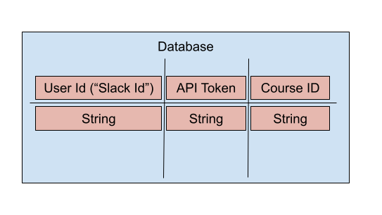

## Team

- Ben Choe
- Cody Davis
- Dylan Ullrich
- Katharine Swilley

## Project Description

Assignment Buster is a Slack App that will help students stay up-to-date with their coursework. Students are able to quickly access their assignments due that day via the app.

## Team Agreement

[Contract](https://docs.google.com/document/d/1Ei7RcvOaHzeyUDbDCYfNEVa91ktPXAih2gQk4I0Fmmc/edit#heading=h.y52avp42q2jv)

## Midterm Prep

 - Summary of idea.

Create a slackbot that will pull a user's Canvas information to notify the user of assignments due that day.

 - What problem or pain point does it solve? a. Keep it high level without going into too much detail. (3-4 sentences is enough)

This project will help student's keep up to date with their assignments. Adding a layer of notification to the student when using slack with ensure they know what is due that day. 

- Minimum Viable Product (MVP) definition.
  - What is the minimum required for you to present on your demo day?

A functional slackbot that will notify the use of items due that day.

## UML/Wireframe

## User Stories 

[Project Management Board](https://trello.com/b/yYzfBtpA/assignment-buster-401-midterm-project)

## Software Requirements

### Vision

*What is the vision of this product?*

A Slackbot that helps students stay up-to-date with their course.

*What pain point does this project solve?*

Students are able to stay up-to-date with their course and quickly access through Slack their assignments due that day.

*Why should we care about your product?*

This product is relevant to students of Code Fellows and supporting their success.

### Scope

***IN - what will your product do?***

- The user(student) will be able to add the slackbot to their workspace
- The slackbot will pull data from Canvas on behalf of the user(student)

***OUT - What will your product NOT do?***

- The user will not be able to access other class data

### MVP

MVP:

- A user can connect to their Canvas account with the slackbot
- present assignments due that day to the user via the slackbot

Stretch:

- present future assignments based on user input (What's due tomorrow? this week?)
- present a user's current grades

### Functional Requirements

- a user can use a slash command to access their assignments

### Non-Functional Requirements

- Testability: We can test our functions in API Gateway. To test Slack connection, we have created our own Slack workspace.
- Security: We will use AWS to host our user database.
